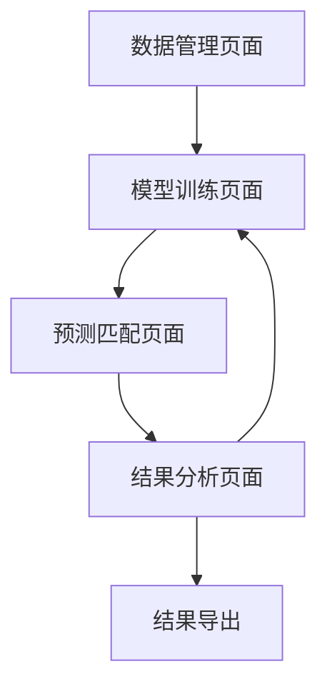

# 图表标题与内容解析匹配系统产品需求文档

## 1. 产品概述

本项目是为2025讯飞AI开发者大赛设计的图表标题与内容解析匹配系统，旨在自动理解图表内容并与正确的标注文本进行匹配。

系统主要解决科学论文中图表的自动化理解问题，通过深度学习技术实现图表视觉元素与自然语言描述的语义对齐，为智能文档理解和信息检索提供技术支撑。

目标是在测试集上达到最高的匹配准确率，在竞赛中获得优异成绩。

## 2. 核心功能

### 2.1 用户角色

| 角色 | 注册方式 | 核心权限 |
|------|----------|----------|
| 数据科学家 | 系统直接使用 | 可以训练模型、调试算法、提交预测结果 |
| 研究人员 | 系统直接使用 | 可以分析图表理解效果、查看匹配结果 |

### 2.2 功能模块

我们的图表解析匹配系统包含以下主要页面：

1. **数据管理页面**：数据集浏览、训练集分析、测试集管理
2. **模型训练页面**：特征提取配置、模型训练监控、超参数调优
3. **预测匹配页面**：图表内容理解、文本匹配计算、结果生成
4. **结果分析页面**：准确率统计、错误案例分析、性能评估

### 2.3 页面详情

| 页面名称 | 模块名称 | 功能描述 |
|----------|----------|----------|
| 数据管理页面 | 数据集浏览器 | 显示训练集500条和测试集1408条数据，支持图表文件预览和标注文本查看 |
| 数据管理页面 | 数据统计分析 | 统计不同格式图表分布（JPG、PNG、PDF），分析标注文本长度和类型分布 |
| 模型训练页面 | 图像特征提取 | 使用ResNet等开源模型提取图表视觉特征，支持多尺度特征融合 |
| 模型训练页面 | 文本特征提取 | 使用Qwen等开源语言模型提取标注文本语义特征，支持中英文处理 |
| 模型训练页面 | 相似度计算 | 实现图像-文本跨模态相似度计算，支持余弦相似度、欧氏距离等多种度量 |
| 模型训练页面 | 模型训练监控 | 实时显示训练损失、验证准确率，支持早停和学习率调度 |
| 预测匹配页面 | 批量预测 | 对测试集1408个图表进行批量预测，生成匹配的标注文本 |
| 预测匹配页面 | 结果导出 | 按照sample_submit.csv格式导出预测结果，支持竞赛提交 |
| 结果分析页面 | 准确率统计 | 计算整体准确率和分类别准确率，支持混淆矩阵可视化 |
| 结果分析页面 | 错误案例分析 | 展示预测错误的图表和文本对，支持人工标注和模型改进 |

## 3. 核心流程

### 数据科学家工作流程
1. 从数据管理页面加载训练集和测试集数据
2. 在模型训练页面配置特征提取参数和训练超参数
3. 启动模型训练，监控训练过程和验证效果
4. 使用训练好的模型在预测匹配页面对测试集进行预测
5. 在结果分析页面查看准确率和错误案例
6. 导出符合竞赛要求的预测结果文件

### 研究人员工作流程
1. 在数据管理页面分析数据集特征和分布
2. 在结果分析页面评估模型性能和预测质量
3. 通过错误案例分析识别模型改进方向

## 4. 用户界面设计

### 4.1 设计风格
- 主色调：科技蓝（#1890FF）和深灰色（#2F3349）
- 辅助色：成功绿（#52C41A）、警告橙（#FA8C16）、错误红（#FF4D4F）
- 按钮样式：圆角矩形，支持悬停效果和点击反馈
- 字体：系统默认字体，标题16px，正文14px，说明文字12px
- 布局风格：卡片式布局，左侧导航栏，顶部工具栏
- 图标风格：线性图标，简洁现代

### 4.2 页面设计概览

| 页面名称 | 模块名称 | UI元素 |
|----------|----------|--------|
| 数据管理页面 | 数据集浏览器 | 表格组件显示文件列表，图片预览组件，文本显示区域，分页控件 |
| 数据管理页面 | 数据统计分析 | 饼图显示格式分布，柱状图显示数量统计，卡片显示关键指标 |
| 模型训练页面 | 特征提取配置 | 下拉选择框选择模型，滑块调整参数，开关控制功能启用 |
| 模型训练页面 | 训练监控 | 实时折线图显示损失和准确率，进度条显示训练进度，日志文本区域 |
| 预测匹配页面 | 批量预测 | 文件上传组件，预测按钮，进度条，结果预览表格 |
| 结果分析页面 | 性能评估 | 仪表盘显示准确率，热力图显示混淆矩阵，表格显示详细指标 |

### 4.3 响应式设计

系统采用桌面优先设计，支持1920x1080及以上分辨率的显示器。界面布局采用栅格系统，支持窗口缩放和多屏显示。考虑到机器学习工作流的特点，优化了大数据表格和图表的显示效果。