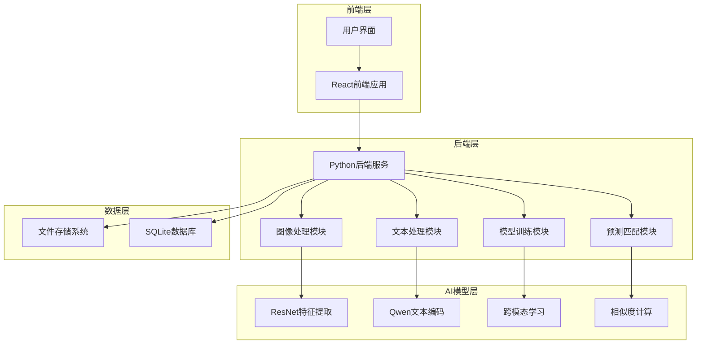
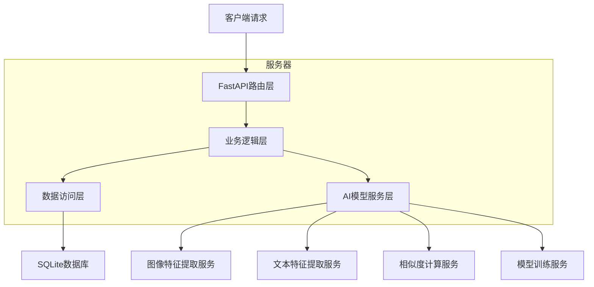
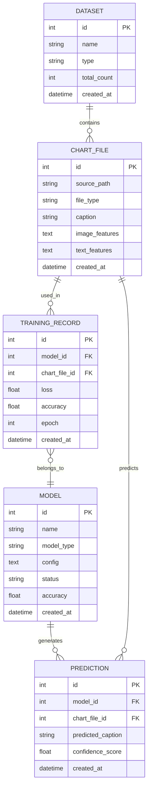

# 图表解析匹配系统技术架构文档

## 1. 架构设计



## 2. 技术描述

* 前端：React\@18 + Ant Design\@5 + TypeScript\@5 + Vite\@4

* 后端：Python\@3.9 + FastAPI\@0.104 + PyTorch\@2.1 + Transformers\@4.35

* 数据库：SQLite\@3.40（本地开发）

* AI框架：PyTorch + Hugging Face Transformers + OpenCV\@4.8

## 3. 路由定义

| 路由        | 用途                 |
| --------- | ------------------ |
| /         | 首页，显示系统概览和快速导航     |
| /data     | 数据管理页面，浏览训练集和测试集   |
| /train    | 模型训练页面，配置和监控训练过程   |
| /predict  | 预测匹配页面，执行图表文本匹配    |
| /analysis | 结果分析页面，查看性能指标和错误分析 |
| /export   | 结果导出页面，生成竞赛提交文件    |

## 4. API定义

### 4.1 核心API

数据管理相关

```
GET /api/data/train
```

响应：

| 参数名称  | 参数类型   | 描述      |
| ----- | ------ | ------- |
| data  | array  | 训练集数据列表 |
| total | number | 总数据量    |
| stats | object | 数据统计信息  |

示例

```json
{
  "data": [
    {
      "source": "./dataset/54f91f80-3400-4913-a8e2-c84882f7c855.pdf",
      "caption": "Comparisons of traditional and explainable fake news detection."
    }
  ],
  "total": 500,
  "stats": {
    "pdf_count": 300,
    "png_count": 150,
    "jpg_count": 50
  }
}
```

模型训练相关

```
POST /api/train/start
```

请求：

| 参数名称             | 参数类型   | 是否必需 | 描述     |
| ---------------- | ------ | ---- | ------ |
| model\_config    | object | true | 模型配置参数 |
| training\_params | object | true | 训练超参数  |

响应：

| 参数名称     | 参数类型   | 描述     |
| -------- | ------ | ------ |
| task\_id | string | 训练任务ID |
| status   | string | 任务状态   |

示例

```json
{
  "model_config": {
    "image_model": "resnet50",
    "text_model": "qwen-7b",
    "embedding_dim": 512
  },
  "training_params": {
    "batch_size": 32,
    "learning_rate": 0.001,
    "epochs": 100
  }
}
```

预测匹配相关

```
POST /api/predict/batch
```

请求：

| 参数名称        | 参数类型   | 是否必需 | 描述       |
| ----------- | ------ | ---- | -------- |
| test\_data  | array  | true | 测试数据列表   |
| model\_path | string | true | 训练好的模型路径 |

响应：

| 参数名称        | 参数类型   | 描述     |
| ----------- | ------ | ------ |
| predictions | array  | 预测结果列表 |
| accuracy    | number | 预测准确率  |

## 5. 服务器架构图



## 6. 数据模型

### 6.1 数据模型定义



### 6.2 数据定义语言

数据集表 (datasets)

```sql
-- 创建表
CREATE TABLE datasets (
    id INTEGER PRIMARY KEY AUTOINCREMENT,
    name VARCHAR(100) NOT NULL,
    type VARCHAR(20) NOT NULL CHECK (type IN ('train', 'test')),
    total_count INTEGER DEFAULT 0,
    created_at TIMESTAMP DEFAULT CURRENT_TIMESTAMP
);

-- 创建索引
CREATE INDEX idx_datasets_type ON datasets(type);
CREATE INDEX idx_datasets_created_at ON datasets(created_at DESC);

-- 初始化数据
INSERT INTO datasets (name, type, total_count) VALUES 
('训练集', 'train', 500),
('测试集', 'test', 1408);
```

图表文件表 (chart\_files)

```sql
-- 创建表
CREATE TABLE chart_files (
    id INTEGER PRIMARY KEY AUTOINCREMENT,
    source_path VARCHAR(255) NOT NULL UNIQUE,
    file_type VARCHAR(10) NOT NULL CHECK (file_type IN ('pdf', 'png', 'jpg')),
    caption TEXT,
    image_features TEXT,
    text_features TEXT,
    dataset_id INTEGER,
    created_at TIMESTAMP DEFAULT CURRENT_TIMESTAMP,
    FOREIGN KEY (dataset_id) REFERENCES datasets(id)
);

-- 创建索引
CREATE INDEX idx_chart_files_source_path ON chart_files(source_path);
CREATE INDEX idx_chart_files_file_type ON chart_files(file_type);
CREATE INDEX idx_chart_files_dataset_id ON chart_files(dataset_id);
```

模型表 (models)

```sql
-- 创建表
CREATE TABLE models (
    id INTEGER PRIMARY KEY AUTOINCREMENT,
    name VARCHAR(100) NOT NULL,
    model_type VARCHAR(50) NOT NULL,
    config TEXT NOT NULL,
    status VARCHAR(20) DEFAULT 'training' CHECK (status IN ('training', 'completed', 'failed')),
    accuracy REAL DEFAULT 0.0,
    model_path VARCHAR(255),
    created_at TIMESTAMP DEFAULT CURRENT_TIMESTAMP,
    updated_at TIMESTAMP DEFAULT CURRENT_TIMESTAMP
);

-- 创建索引
CREATE INDEX idx_models_status ON models(status);
CREATE INDEX idx_models_accuracy ON models(accuracy DESC);
CREATE INDEX idx_models_created_at ON models(created_at DESC);
```

训练记录表 (training\_records)

```sql
-- 创建表
CREATE TABLE training_records (
    id INTEGER PRIMARY KEY AUTOINCREMENT,
    model_id INTEGER NOT NULL,
    chart_file_id INTEGER NOT NULL,
    loss REAL NOT NULL,
    accuracy REAL NOT NULL,
    epoch INTEGER NOT NULL,
    created_at TIMESTAMP DEFAULT CURRENT_TIMESTAMP,
    FOREIGN KEY (model_id) REFERENCES models(id),
    FOREIGN KEY (chart_file_id) REFERENCES chart_files(id)
);

-- 创建索引
CREATE INDEX idx_training_records_model_id ON training_records(model_id);
CREATE INDEX idx_training_records_epoch ON training_records(epoch);
```

预测结果表 (predictions)

```sql
-- 创建表
CREATE TABLE predictions (
    id INTEGER PRIMARY KEY AUTOINCREMENT,
    model_id INTEGER NOT NULL,
    chart_file_id INTEGER NOT NULL,
    predicted_caption TEXT NOT NULL,
    confidence_score REAL NOT NULL,
    is_correct BOOLEAN,
    created_at TIMESTAMP DEFAULT CURRENT_TIMESTAMP,
    FOREIGN KEY (model_id) REFERENCES models(id),
    FOREIGN KEY (chart_file_id) REFERENCES chart_files(id)
);

-- 创建索引
CREATE INDEX idx_predictions_model_id ON predictions(model_id);
CREATE INDEX idx_predictions_confidence_score ON predictions(confidence_score DESC);
CREATE INDEX idx_predictions_is_correct ON predictions(is_correct);
```

